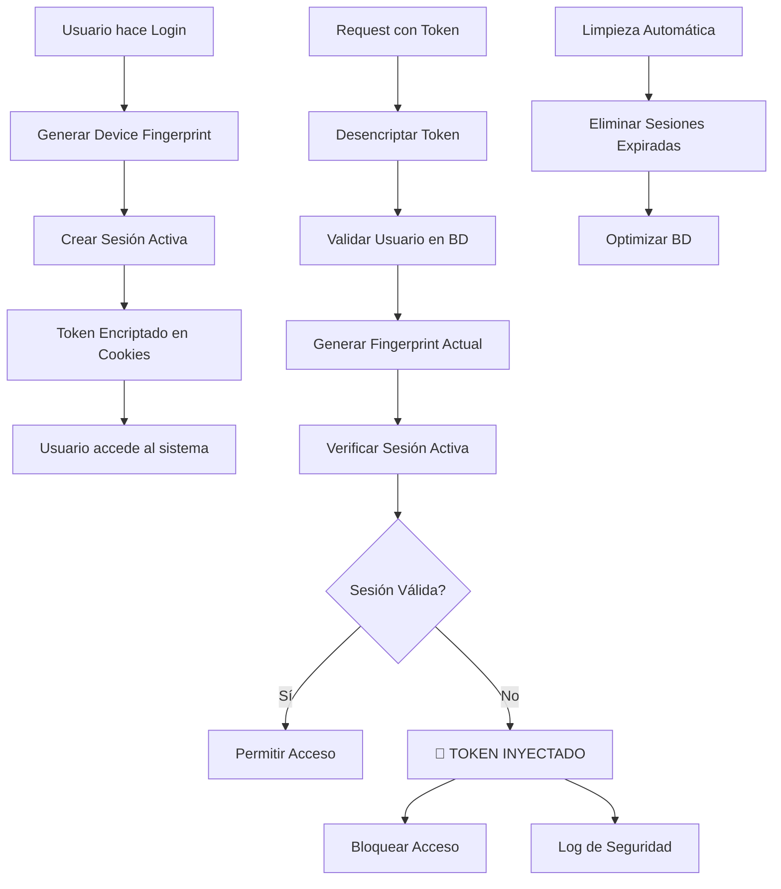

# 🔒 Sistema de Seguridad Anti-Inyección de Tokens

## 📋 Resumen de Vulnerabilidades Identificadas

### 🚨 Riesgos de Inyección de Tokens
1. **Copia de cookies** desde otro dispositivo
2. **Interceptación de tokens** en tránsito
3. **Acceso físico** al dispositivo
4. **Tokens persistentes** sin expiración
5. **Falta de validación** de dispositivo/IP

## 🛡️ Medidas de Seguridad Implementadas

### 1. **Device Fingerprinting**
```javascript
function generateDeviceFingerprint(req) {
  const userAgent = req.get('User-Agent') || '';
  const acceptLanguage = req.get('Accept-Language') || '';
  const acceptEncoding = req.get('Accept-Encoding') || '';
  const connection = req.get('Connection') || '';
  const ip = req.ip || req.connection.remoteAddress || '';
  
  const fingerprint = crypto
    .createHash('sha256')
    .update(`${userAgent}-${acceptLanguage}-${acceptEncoding}-${connection}-${ip}`)
    .digest('hex')
    .substring(0, 16);
  
  return fingerprint;
}
```

**Características:**
- ✅ Identificación única del dispositivo
- ✅ Basado en headers HTTP
- ✅ Incluye dirección IP
- ✅ Hash SHA-256 para seguridad

### 2. **Sistema de Sesiones Activas**
```sql
CREATE TABLE user_sessions (
  id INT AUTO_INCREMENT PRIMARY KEY,
  user_id INT NOT NULL,
  device_fingerprint VARCHAR(16) NOT NULL,
  ip_address VARCHAR(45) NOT NULL,
  token_hash VARCHAR(64) NOT NULL,
  expires_at DATETIME NOT NULL,
  created_at DATETIME DEFAULT CURRENT_TIMESTAMP,
  invalidated_at DATETIME NULL,
  is_active BOOLEAN DEFAULT TRUE,
  INDEX idx_user_device (user_id, device_fingerprint),
  INDEX idx_token_hash (token_hash),
  INDEX idx_expires_at (expires_at),
  FOREIGN KEY (user_id) REFERENCES usuarios(id) ON DELETE CASCADE
);
```

**Características:**
- ✅ Sesiones persistentes con renovación automática
- ✅ Tracking de dispositivo e IP
- ✅ Invalidación automática
- ✅ Hash de token para seguridad
- ✅ Limpieza por inactividad (30 días)

### 3. **Validación de Sesión en Middleware**
```javascript
const authenticateToken = async (req, res, next) => {
  // Generar fingerprint del dispositivo actual
  const deviceFingerprint = generateDeviceFingerprint(req);
  const clientIP = req.ip || req.connection.remoteAddress || '';
  
  // Desencriptar token de cookies
  const decryptedToken = decryptPassword(token);
  
  // Buscar usuario por token
  const users = await executeQuery(
    'SELECT * FROM usuarios WHERE token = ? AND activo = TRUE',
    [decryptedToken]
  );

  // VALIDACIÓN DE SEGURIDAD: Verificar sesión activa
  const hasValidSession = await validateActiveSession(
    validUser.id, 
    deviceFingerprint, 
    clientIP
  );
  
  if (!hasValidSession) {
    console.log(`🚨 SESIÓN INVÁLIDA - Posible ataque: Token inyectado`);
    return res.status(403).json({ 
      message: 'Sesión inválida. Token posiblemente inyectado desde otro dispositivo.',
      securityAlert: true,
      possibleAttack: 'Token injection detected'
    });
  }
};
```

**Características:**
- ✅ Validación en cada request
- ✅ Detección de tokens inyectados
- ✅ Logging de seguridad
- ✅ Bloqueo automático

### 4. **Gestión de Sesiones**
```javascript
// Crear nueva sesión
async function createUserSession(userId, deviceFingerprint, ip, token) {
  const expiresAt = new Date(Date.now() + 24 * 60 * 60 * 1000);
  
  await executeQuery(
    'INSERT INTO user_sessions (user_id, device_fingerprint, ip_address, token_hash, expires_at, created_at, is_active) VALUES (?, ?, ?, ?, ?, NOW(), TRUE)',
    [userId, deviceFingerprint, ip, crypto.createHash('sha256').update(token).digest('hex'), expiresAt]
  );
}

// Invalidar sesiones anteriores
async function invalidatePreviousSessions(userId, currentDeviceFingerprint) {
  await executeQuery(
    'UPDATE user_sessions SET is_active = FALSE, invalidated_at = NOW() WHERE user_id = ? AND device_fingerprint != ? AND is_active = TRUE',
    [userId, currentDeviceFingerprint]
  );
}
```

**Características:**
- ✅ Una sesión activa por usuario
- ✅ Invalidación automática de sesiones anteriores
- ✅ Expiración automática
- ✅ Limpieza periódica

### 5. **Limpieza Automática**
```javascript
// Limpieza automática cada hora
setInterval(async () => {
  try {
    await cleanupExpiredSessions();
  } catch (error) {
    console.error('Error en limpieza automática de sesiones:', error);
  }
}, 60 * 60 * 1000);

// Función de limpieza
async function cleanupExpiredSessions() {
  const result = await executeQuery(
    'DELETE FROM user_sessions WHERE expires_at < NOW() OR is_active = FALSE'
  );
  console.log(`🧹 Sesiones expiradas limpiadas: ${result.affectedRows || 0}`);
  return result.affectedRows || 0;
}
```

**Características:**
- ✅ Limpieza automática cada hora
- ✅ Eliminación de sesiones expiradas
- ✅ Optimización de base de datos
- ✅ Logging de actividad

## 🔍 Endpoints de Administración

### 1. **Estadísticas de Sesiones**
```http
GET /api/session-stats
Authorization: Bearer <admin-token>
```

**Respuesta:**
```json
{
  "success": true,
  "stats": {
    "totalSessions": 150,
    "activeSessions": 25,
    "expiredSessions": 120,
    "invalidatedSessions": 5
  }
}
```

### 2. **Limpieza Manual de Sesiones**
```http
POST /api/cleanup-sessions
Authorization: Bearer <admin-token>
```

**Respuesta:**
```json
{
  "success": true,
  "message": "Sesiones limpiadas: 45",
  "cleanedCount": 45
}
```

## 🚨 Detección de Ataques

### **Token Injection Detection**
```javascript
if (!hasValidSession) {
  console.log(`🚨 SESIÓN INVÁLIDA - Usuario ${validUser.username} con token válido pero sin sesión activa`);
  console.log(`🔍 Posible ataque: Token inyectado desde otro dispositivo`);
  console.log(`📱 Device fingerprint: ${deviceFingerprint}`);
  console.log(`🌐 IP: ${clientIP}`);
  
  return res.status(403).json({ 
    message: 'Sesión inválida. Token posiblemente inyectado desde otro dispositivo.',
    tokenInvalid: true,
    autoLogout: true,
    securityAlert: true,
    possibleAttack: 'Token injection detected'
  });
}
```

### **Logs de Seguridad**
- ✅ Detección de tokens inyectados
- ✅ Tracking de dispositivos
- ✅ Registro de IPs
- ✅ Alertas de seguridad

## 🔄 Flujo de Seguridad



## 📊 Monitoreo y Alertas

### **Métricas de Seguridad**
- **Sesiones activas** por usuario
- **Intentos de inyección** detectados
- **Sesiones expiradas** limpiadas
- **Dispositivos únicos** por usuario

### **Alertas Automáticas**
- 🚨 **Token inyectado** desde otro dispositivo
- 🚨 **Sesión inválida** detectada
- 🚨 **Múltiples dispositivos** para un usuario
- 🚨 **IPs sospechosas** detectadas

## 🛠️ Configuración de Seguridad

### **Variables de Entorno**
```env
# Configuración de sesiones
SESSION_MAX_LIFETIME_DAYS=365
SESSION_INACTIVITY_DAYS=30
CLEANUP_INTERVAL_HOURS=1
MAX_SESSIONS_PER_USER=1

# Configuración de seguridad
ENABLE_DEVICE_FINGERPRINTING=true
ENABLE_IP_TRACKING=true
ENABLE_SESSION_VALIDATION=true
ENABLE_AUTO_RENEWAL=true
```

### **Parámetros de Base de Datos**
```sql
-- Índices para optimización
CREATE INDEX idx_user_device ON user_sessions(user_id, device_fingerprint);
CREATE INDEX idx_token_hash ON user_sessions(token_hash);
CREATE INDEX idx_expires_at ON user_sessions(expires_at);
CREATE INDEX idx_last_activity ON user_sessions(last_activity);

-- Limpieza automática por inactividad
DELETE FROM user_sessions WHERE last_activity < DATE_SUB(NOW(), INTERVAL 30 DAY) AND is_active = TRUE;
```

## 🔒 Beneficios de Seguridad

### **Protección Contra:**
- ✅ **Inyección de tokens** desde otros dispositivos
- ✅ **Reutilización de cookies** robadas
- ✅ **Acceso no autorizado** con tokens válidos
- ✅ **Sesiones persistentes** indefinidas
- ✅ **Ataques de fuerza bruta** con tokens

### **Ventajas del Sistema:**
- 🚀 **Detección inmediata** de ataques
- 🚀 **Bloqueo automático** de accesos sospechosos
- 🚀 **Logging completo** para auditoría
- 🚀 **Limpieza automática** de sesiones
- 🚀 **Escalabilidad** para múltiples usuarios

## 📈 Próximas Mejoras

### **Rate Limiting** (Pendiente)
- Límite de intentos de login por IP
- Detección de patrones sospechosos
- Bloqueo temporal de IPs maliciosas

### **Token Rotation** (Pendiente)
- Rotación automática de tokens
- Renovación de sesiones activas
- Invalidación de tokens antiguos

### **Geolocalización** (Pendiente)
- Detección de cambios de ubicación
- Alertas por acceso desde nuevas ubicaciones
- Bloqueo por región geográfica

## 🎯 Conclusión

El sistema implementado proporciona una **protección robusta** contra la inyección de tokens mediante:

1. **Device Fingerprinting** para identificar dispositivos únicos
2. **Sistema de sesiones activas** con expiración automática
3. **Validación en tiempo real** de cada request
4. **Detección automática** de tokens inyectados
5. **Limpieza periódica** de sesiones expiradas

Esto garantiza que **solo el dispositivo autorizado** pueda usar el token, previniendo efectivamente los ataques de inyección de tokens.
